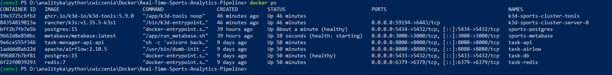
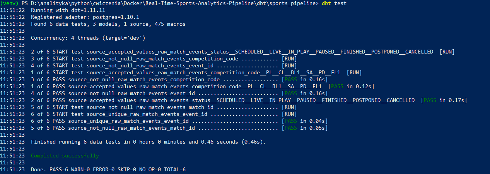
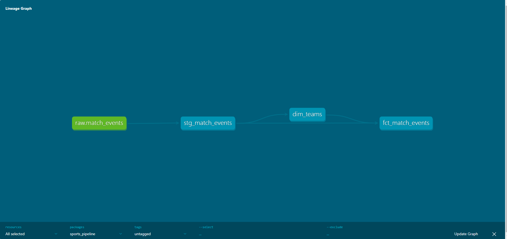

# 🏟️ Real-Time Sports Analytics Pipeline

> **Portfolio project — Data Engineer (Junior)**  
> Stack: Python · PySpark · Kafka · dbt · PostgreSQL · Docker · Kubernetes

Pipeline do przetwarzania w czasie rzeczywistym danych z meczów piłkarskich. Eventy meczowe przepływają przez Kafkę, są transformowane przez PySpark (architektura medalion Bronze/Silver) i ładowane do PostgreSQL, gdzie dbt buduje modele analityczne gotowe do raportowania.

---

## Architektura

```
[football-data.org API]
         │
         ▼
[Kafka Producer (Python)]
  httpx + tenacity (retry)
         │
         ▼
[Kafka Topic: raw_match_events]
  3 partycje, klucz = match_id
         │
         ▼
[PySpark Structured Streaming]
  schema enforcement, checkpointing
         │
         ▼
[Bronze Layer — Parquet]
  surowe dane, partycja po ingestion_date
         │
         ▼
[PySpark Batch Job]
  dedup (window functions), cast typów
         │
         ▼
[Silver Layer — Parquet]
  czyste dane, partycja po match_date
         │
         ▼
[PostgreSQL — raw.match_events]
         │
         ▼
[dbt Models]
  stg_match_events → dim_teams
                   → fct_match_events
         │
         ▼
[analytics schema — Gold Layer]
```

### Warstwa medallion

| Warstwa | Opis | Technologia |
|---------|------|-------------|
| **Bronze** | Surowe eventy z Kafki bez transformacji | PySpark Streaming + Parquet |
| **Silver** | Oczyszczone dane, deduplikacja, typy | PySpark Batch |
| **Gold** | Modele analityczne gotowe do raportowania | dbt + PostgreSQL |

---

## Struktura repozytorium

```
sports-pipeline/
├── producer/                   # Kafka Producer
│   ├── config.py               # Konfiguracja z env vars
│   ├── api_client.py           # HTTP client z retry logic
│   ├── kafka_producer.py       # Wrapper Kafki z DLQ
│   ├── schemas.py              # Normalizacja eventów
│   ├── main.py                 # Entrypoint
│   ├── requirements.txt
│   └── .env.example
│
├── spark/                      # PySpark Jobs
│   ├── streaming_job.py        # Bronze: Kafka → Parquet
│   ├── batch_job.py            # Silver: dedup + transformacje
│   ├── match_event_schema.py   # StructType schema
│   └── requirements.txt
│
├── dbt/                        # dbt Models
│   └── sports_pipeline/
│       └── models/
│           ├── staging/
│           │   ├── stg_match_events.sql
│           │   └── sources.yml
│           └── marts/
│               ├── dim_teams.sql
│               ├── fct_match_events.sql
│               └── schema.yml
│
├── k8s/                        # Kubernetes Manifesty
│   ├── configmap.yaml
│   ├── spark-batch-job.yaml
│   └── producer-deployment.yaml
│
├── docker-compose.yml          # Lokalny stack
├── pg_hba.conf                 # PostgreSQL auth config
└── .gitignore
```

---

## Jak uruchomić lokalnie

### Wymagania

- Docker Desktop
- Python 3.11 (dla PySpark) i Python 3.13 (dla dbt)
- Java 8+ (dla PySpark)
- Darmowy klucz API z [football-data.org](https://www.football-data.org/)

### 1. Sklonuj repozytorium

```bash
git clone https://github.com/TWOJ_NICK/sports-pipeline
cd sports-pipeline
```

### 2. Skonfiguruj zmienne środowiskowe

```bash
cp producer/.env.example producer/.env
# Wpisz swój klucz API w producer/.env
```

### 3. Uruchom infrastrukturę

```bash
docker compose up -d kafka zookeeper postgres
```


### 4. Stwórz Kafka topic

```bash
docker exec -it sports-kafka kafka-topics \
  --create --if-not-exists \
  --topic raw_match_events \
  --bootstrap-server localhost:9092 \
  --partitions 3 \
  --replication-factor 1
```

### 5. Uruchom Kafka Producer

```bash
cd producer
pip install -r requirements.txt
python main.py
```

### 6. Uruchom PySpark Streaming (Bronze layer)

W osobnym terminalu, z venv Pythona 3.11:

```bash
cd spark
python -3.11 -m venv venv
.\venv\Scripts\Activate.ps1   # Windows
pip install -r requirements.txt
python streaming_job.py
```

### 7. Uruchom PySpark Batch Job (Silver layer)

```bash
python batch_job.py
```

### 8. Załaduj dane do PostgreSQL i uruchom dbt

```bash
cd ../dbt
python -m venv venv
.\venv\Scripts\Activate.ps1
pip install -r requirements.txt
python load_silver_to_postgres.py

cd sports_pipeline
dbt run
dbt test
```


### 9. Otwórz dokumentację dbt

```bash
dbt docs generate
dbt docs serve --port 8082
# Otwórz http://localhost:8082
```


---

## dbt Lineage Graph

```
raw.match_events
      │
      ▼
stg_match_events (VIEW)
      │
      ├──▶ dim_teams (TABLE)
      │          │
      └──────────┴──▶ fct_match_events (TABLE)
```

### Wyniki testów dbt

```
✓ source_unique_raw_match_events_event_id
✓ source_not_null_raw_match_events_event_id
✓ source_not_null_raw_match_events_match_id
✓ source_not_null_raw_match_events_competition_code
✓ source_accepted_values_raw_match_events_competition_code
✓ source_accepted_values_raw_match_events_status

6/6 PASS ✓
```


---

## Kubernetes (lokalnie z k3d)

```bash
# Stwórz klaster
k3d cluster create sports-cluster --no-lb

# Zastosuj konfigurację
kubectl apply -f k8s/configmap.yaml
kubectl apply -f k8s/secret.yaml

# Uruchom Spark batch job
kubectl apply -f k8s/spark-batch-job.yaml
kubectl get jobs
kubectl logs job/spark-silver-batch
```

---

## Kluczowe decyzje techniczne

**Dlaczego Kafka zamiast HTTP polling?**
Decoupling między producentem a konsumentami — można dodać nowego konsumenta (alerty, ML) bez zmiany producenta. Klucz wiadomości = `match_id` gwarantuje kolejność eventów per mecz.

**Dlaczego PySpark zamiast pandas?**
Skalowalność — ten sam kod działa na 1 GB i 1 TB. Window functions do deduplikacji zachowują kontrolę nad tym, który duplikat wygrał (najwyższy `kafka_offset`).

**Dlaczego dbt?**
Lineage, testy, dokumentacja. `dbt docs generate` tworzy automatycznie interaktywny data catalog. Oddzielenie logiki transformacji od infrastruktury.

**Dlaczego architektura medallion?**
Bronze = surowe dane (możliwość powrotu do źródła). Silver = czyste dane do analiz. Gold = modele biznesowe. Błąd w transformacji Silver nie niszczy Bronze.

---

## Dane

Projekt używa danych z [football-data.org](https://www.football-data.org/) (darmowy tier, 10 req/min).  
Obsługiwane ligi: Premier League (PL), Champions League (CL), Bundesliga (BL1).

---

## Autor

** Natalia Kurek ** · [LinkedIn](www.linkedin.com/in/natalia-kurek-b46660308) · [GitHub](https://github.com/nataliakloc96-ui)